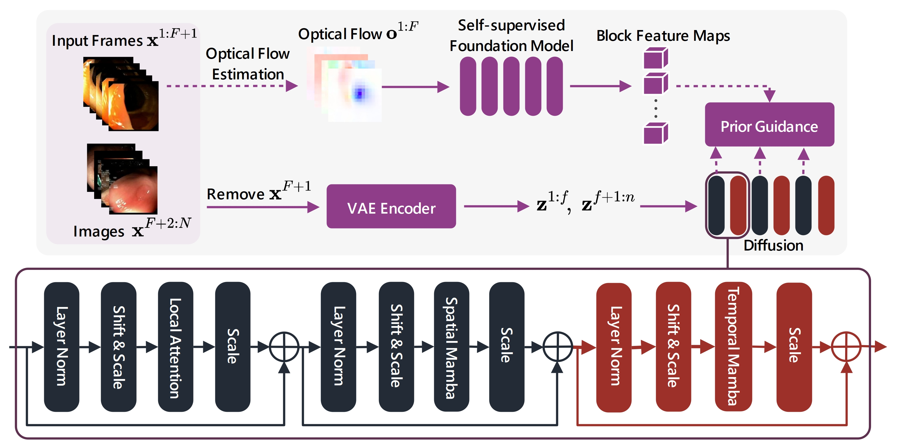
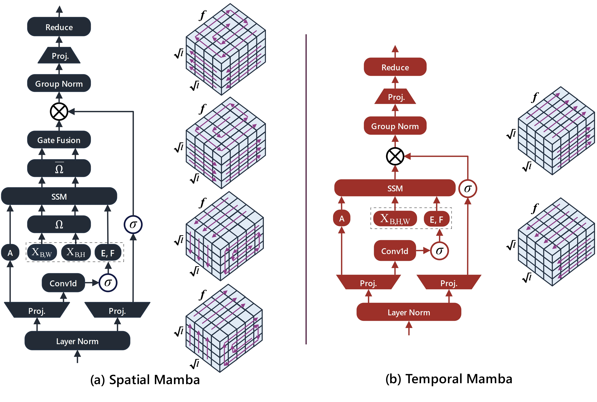

<div id="top" align="center">

# MedSora: Optical Flow Representation Alignment Mamba Diffusion Model for Medical Video Generation
  [Zhenbin Wang](https://github.com/wongzbb), Lei Zhang<sup>✉</sup>, [Lituan Wang](https://github.com/LTWangSCU), [Minjuan Zhu](https://github.com/zhuminjuan), [Zhenwei Zhang](https://github.com/Zhangzw-99) 
  
  </br>
  [](https://github.com/wongzbb)
  </br>
</div>

-------------------------------------------

<!--  -->

## 🛠 Setup

```bash
git clone https://github.com/wongzbb/MedSora.git
cd MedSora
conda create -n MedSora python=3.10.0
conda activate MedSora

conda install cudatoolkit==11.7 -c nvidia
pip install torch==2.0.0 torchvision==0.15.0 torchaudio==2.0.0 --index-url https://download.pytorch.org/whl/cu117
conda install -c "nvidia/label/cuda-11.7.0" cuda-nvcc

pip install open_clip_torch loguru wandb diffusers["torch"] transformers einops omegaconf torchmetrics local_attention pyAV decord accelerate imageio-ffmpeg imageio pytest fvcore chardet yacs termcolor submitit tensorboardX seaborn lpips

conda install packaging

# for official mamba
mkdir whl && cd whl
wget https://github.com/Dao-AILab/causal-conv1d/releases/download/v1.4.0/causal_conv1d-1.4.0+cu118torch2.0cxx11abiFALSE-cp310-cp310-linux_x86_64.whl
wget https://github.com/state-spaces/mamba/releases/download/v2.2.2/mamba_ssm-2.2.2+cu118torch2.0cxx11abiFALSE-cp310-cp310-linux_x86_64.whl
pip install causal_conv1d-1.4.0+cu118torch2.0cxx11abiFALSE-cp310-cp310-linux_x86_64.whl
pip install mamba_ssm-2.2.2+cu118torch2.0cxx11abiFALSE-cp310-cp310-linux_x86_64.whl && cd ..

pip install triton==3.0.0
which ptxas  # will output your_ptxas_path

# for Chinese, you may need
export HF_ENDPOINT=https://hf-mirror.com
```
## 📚 Data Preparation
**Cholec Triplet**:  You can directly use the [processed data](https://huggingface.co/datasets/ZhenbinWang/CholecTriplet_processed) without further data processing.
```
huggingface-cli download --repo-type dataset --resume-download ZhenbinWang/CholecTriplet_processed --local-dir ./datasets/CholecTriplet_processed/
```
**Colonoscopic**:   You can directly use the [processed data](https://huggingface.co/datasets/ZhenbinWang/Colonoscopic_processed) without further data processing.
```
huggingface-cli download --repo-type dataset --resume-download ZhenbinWang/Colonoscopic_processed --local-dir ./datasets/Colonoscopic_processed/
```
**Kvasir Capsule**:   You can directly use the [processed data](https://huggingface.co/datasets/ZhenbinWang/Kvasir_Capsule_processed) without further data processing.
```
huggingface-cli download --repo-type dataset --resume-download ZhenbinWang/Kvasir_Capsule_processed --local-dir ./datasets/Kvasir_Capsule_processed/
```


## ⏳ Training Frequency Compensation Video VAE
Run [`train_vae.py`](train_vae.py) with the resolution of 128x128 with `1` GPUs on the Colonoscopic dataset
```bash
CUDA_VISIBLE_DEVICES=0 \
torchrun \
  --master_port=12345 \
  --nnodes=1 \
  --nproc_per_node=1 \
train_vae.py \
  --config configs/col/col_train.yaml
```
Or run training VAE with scripts in [`./scripts`](./scripts/)
```bash
bash scripts/train_vae_col.sh
bash scripts/train_vae_cho.sh
bash scripts/train_vae_kva.sh
```

## ✨ Test Frequency Compensation Video VAE
Run [`test_vae.py`](test_vae.py) on the Colonoscopic dataset
```bash
CUDA_VISIBLE_DEVICES=0 \
torchrun \
  --master_port=12345 \
  --nnodes=1 \
  --nproc_per_node=1 \
test_vae.py \
  --config configs/col/col_train.yaml
```
Or run test VAE with scripts in [`./scripts`](./scripts/)
```bash
bash scripts/test_vae_col.sh
bash scripts/test_vae_cho.sh
bash scripts/test_vae_kva.sh
```

## ⏳ Training MedSora
Run [`train.py`](train.py) with the resolution of 128x128 with `2` GPUs on the Colonoscopic dataset
```bash
OMP_NUM_THREADS=4 \
CUDA_VISIBLE_DEVICES=1,3 \
TRITON_PTXAS_PATH=/opt/conda/envs/test_sora/bin/ptxas \
torchrun \
  --master_port=12045 \
  --nnodes=1 \
  --nproc_per_node=2 \
train.py \
  --model MedSora-B \
  --epoch 300 \
  --global-batch-size 1 \
  --config configs/col/col_train.yaml \
  --use-local-cov
```
Or run training MedSora with scripts in [`./scripts`](./scripts/)
```bash
bash scripts/train_medsora_col.sh
bash scripts/train_medsora_cho.sh
bash scripts/train_medsora_kva.sh
```

## ✨ Sampling MedSora
Run [`sample.py`](sample.py) by the following scripts.
```bash
CUDA_VISIBLE_DEVICES=0 \
TRITON_PTXAS_PATH=path_to_your_ptxas \
torchrun \
  --master_port=12345 \
  --nnodes=1 \
  --nproc_per_node=1 \
sample.py \
  --model MedSora-B \
  --config configs/col/col_train.yaml \
  --ckpt path_to_your_checkpoint \
  --use-local-cov
```
Or run sampling MedSora with scripts in [`./scripts`](./scripts/)
```bash
bash scripts/sample_medsora_col.sh
bash scripts/sample_medsora_cho.sh
bash scripts/sample_medsora_cho.sh
```

## 🛒TODO List
- [X] Release code for MedSora
- [X] Clean up the code for MedSora
- [ ] Upload the code for calculating the metrics.
- [ ] Upload the codes for training compared methods.
- [ ] Upload the ckpt (will upload after publication).
